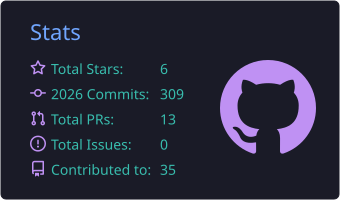
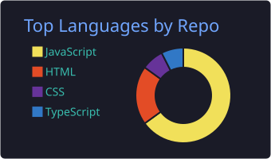
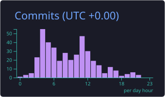



  

<h3 align="center">
  JavaScript Full Stack Engineer | React.js• Next.js • Vue.js • Nuxt.js • Node.js • JavaScript
</h3>

  <em>A passionate Full-Stack Web Developer from Pakistan</em> 
  <em>Building scalable, modern, and responsive web applications</em> 
  <em>Turning ideas into high-performance digital experiences</em>

  
  
  

 

  

 

---

## 🚀 About Me

> *"Clean code is simple and direct. Clean code reads like well-written prose."* — Steve McConnell

I build scalable web applications using React, Next.js, Vue, Nuxt, Node.js and TypeScript. I enjoy **designing clean architectures**, building performant user experiences, and shipping **production-ready software**. I'm currently focused on modern **frontend engineering**, **scalable backend services**, and **open-source contributions**.

- 🔭 Full-stack developer with expertise in **Vue.js, Nuxt.js, React & Next.js**
- 💡 Experienced in building **production-ready apps** with real-world tech stacks
- 🤖 Skilled in **Prompt Engineering** & AI-powered development workflows
- 🌍 Based in **Pakistan** — open to remote opportunities worldwide
- 📈 Passionate about clean code, performance & scalable architecture
- ⚡ Delivered **20+ projects** with **99% client satisfaction**

---

## 🛠️ Tech Stack

### 🌐 Frontend Development
<table>
<tr>
  <td align="center" width="100">
    
     <b>React</b>
  </td>

  <td align="center" width="100">
    
     <b>Next.js</b>
  </td>

  <td align="center" width="100">
    
     <b>Vue.js</b>
  </td>

  <td align="center" width="100">
    
     <b>Nuxt.js</b>
  </td>

  <td align="center" width="100">
    
     <b>JavaScript</b>
  </td>

  <td align="center" width="100">
    
     <b>TypeScript</b>
  </td>

  <td align="center" width="100">
    
     <b>HTML5</b>
  </td>

  <td align="center" width="100">
    
     <b>CSS3</b>
  </td>

  <td align="center" width="100">
    
     <b>Tailwind</b>
  </td>
</tr>
</table>

---

### ⚙️ Backend & Databases
<table>
<tr>

  <td align="center" width="100">
    
     <b>Node.js</b>
  </td>

  <td align="center" width="100">
    
     <b>Express</b>
  </td>

  <td align="center" width="100">
    
     <b>MongoDB</b>
  </td>

  <td align="center" width="100">
    
     <b>PostgreSQL</b>
  </td>

  <td align="center" width="100">
    
     <b>MySQL</b>
  </td>

</tr>
</table>

---

### 💻 Programming Languages
<table>
<tr>

<td align="center" width="100">

 <b>JavaScript</b>
</td>

<td align="center" width="100">

 <b>TypeScript</b>
</td>

<td align="center" width="100">

 <b>Python</b>
</td>

<td align="center" width="100">

 <b>C++</b>
</td>

</tr>
</table>

---

### 🛠️ Tools & Platforms
<table>
<tr>

<td align="center" width="100">

 <b>VS Code</b>
</td>

<td align="center" width="100">

 <b>Git</b>
</td>

<td align="center" width="100">

 <b>GitHub</b>
</td>

<td align="center" width="100">

 <b>Figma</b>
</td>

<td align="center" width="100">

 <b>Postman</b>
</td>

<td align="center" width="100">

 <b>Docker</b>
</td>

</tr>
</table>

---

### 🚀 Deployment & DevOps
<table>
<tr>

  <td align="center" width="100">
    
     <b>Vercel</b>
  </td>

  <td align="center" width="100">
    
     <b>Netlify</b>
  </td>

 

  <td align="center" width="100">
    
     <b>Docker</b>
  </td>

  <td align="center" width="100">
    
     <b>GitHub Actions</b>
  </td>

 

  <td align="center" width="100">
    
     <b>Linux</b>
  </td>

</tr>
</table>

## 🚀 Featured Projects

### 🌐 Successfully Launched
> Exciting new project has been successfully launched 🚀

[🔗 **Live Demo**](https://ai-clinic-management-smart-diagnosi-lime.vercel.app/) ·

*🚀 Modern SSR/SSG capabilities with React Vite*

**Tech Stack:**   

**What to Expect:**
- 🚀 Modern frontend development with React
- 📝 Fully type-safe development with TypeScript
- 🔧 Robust backend architecture with Express.js
- 🎨 Beautiful, responsive UI with Tailwind CSS
- ⚡ Optimized performance & SEO-friendly

🔗 *Stay tuned for updates!*

---

## 📝 Blog & Articles

> 📢 **Coming Soon** — I'll be sharing technical deep-dives, tutorials, and insights on:
> - React.js & Next.js best practices
> - Building scalable web applications
> - AI-powered development workflows
> - Clean code & architecture patterns

*🔔 Follow me on [LinkedIn](https://www.linkedin.com/in/shah-faisal-khalil-1270392bb/) for updates!*

---

## 💼 Work Experience & Availability

| Status | Availability | Location |
|--------|--------------|----------|
| 🟢 **OPEN TO WORK** | Freelance & Full-time | Remote Worldwide |

**What I Bring to Your Team:**
- 🎯 **Problem Solver** – I don't just write code, I solve business problems
- 🤝 **Team Player** – Strong communication and collaboration skills
- ⏰ **Deadline Driven** – Consistent delivery on time
- 📚 **Continuous Learner** – Always staying updated with latest tech

---

## 🤖 Prompt Engineering & AI Workflows

> *"AI won't replace developers, but developers who use AI will replace those who don't."*

I leverage AI tools to accelerate development and improve code quality:

- 🧠 **Experienced with:** Claude, ChatGPT, Gemini, Cursor
- ⚡ **AI-Powered Workflows:** Code generation, review, debugging & documentation
- 🔄 **Integration:** Using AI for rapid prototyping and testing
- 📖 **Knowledge Sharing:** Teaching effective prompt engineering techniques

---

## 📊 GitHub Stats & Activity

<!-- <table>
<tr>
<td valign="top">

</td>
<td valign="top">

</td>

<td valign="top">

</td>
</tr>
</table> -->

  

---

<!-- ## � Certifications -->

<!-- 

| Certification | Issuer | Year |
|---------------|--------|------|
| 🎓 **Full-Stack Web Development** | *Sylani* | 2025 |
| 🎓 **JavaScript Algorithms & Data Structures** | freeCodeCamp | 2024 |
| 🎓 **Prompt Engineering for Developers** | DeepLearning.AI | 2024 |

*💡 Always learning, always growing — more certifications coming soon!*

 -->

---

## 📫 Let's Connect

### 👋 Let's Build Something Great Together

I'm always interested in collaborating on impactful projects, contributing to open source, and discussing opportunities in full-stack web development.

💼 **Open to:** Remote • Full-Time • Freelance • Contract • Onsite • Hybrid

 

---

⭐ If you find my work interesting, feel free to explore my repositories, leave a ⭐, or connect with me.

> ⭐️ **Building scalable products with modern JavaScript technologies**.

**Open to remote opportunities worldwide.**

